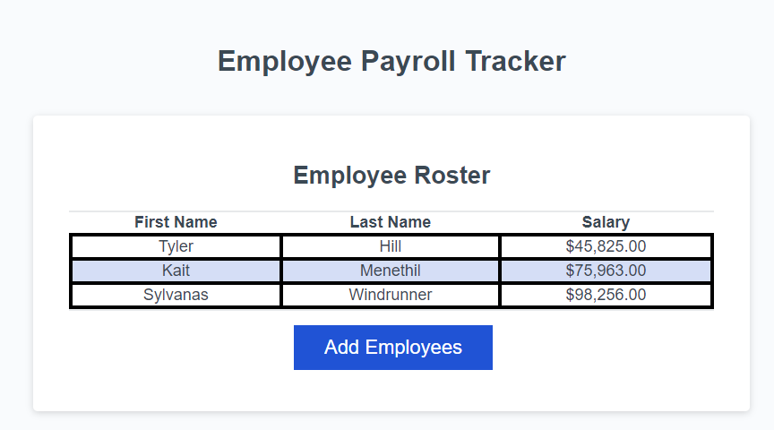
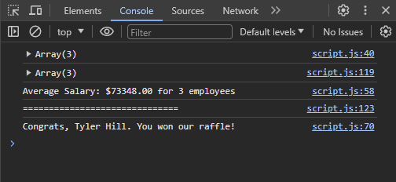

# <Employee Payroll Tracker>

## Description

This project serves as a tracking sheet for employees and their salaries. The user is prompted to enter the first names, last names, and salaries of various employees, which is displayed on a table. It also tracks the average salary, and draws a random employee from the list in the console. 

## Installation

This project can be accessed clicking the URL, which should open it in any browser. 

## Usage

This website is meant to be used as a payroll tracker for an employer. As mentioned in the description, you can enter employees, salaries, track averages, and pull random employees for incentives, raffles, etc. 

## Credits

In collaboration with: 
The UNC Chapel Hill/EdX Full Stack Bootcamp

With special credits to: 

Edward Apostol

## License

MIT License 
---